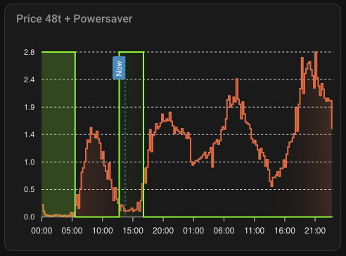

<p align="center">
  
</p>

<h1 align="center">Power Saver</h1>

<p align="center">
  A Home Assistant custom integration that schedules appliances during the cheapest (or most expensive) electricity hours using<br>
  <a href="https://www.home-assistant.io/integrations/nordpool/">Nordpool</a> prices to save money automatically.
</p>

<p align="center">
  <a href="https://github.com/hacs/integration"></a>
  <a href="https://github.com/jyourstone/power_saver/releases"></a>
  <a href="https://github.com/jyourstone/power_saver/blob/main/LICENSE"></a>
  <a href="https://buymeacoffee.com/jyourstone"></a>
</p>

---

## Features

- **Two scheduling strategies** — Choose the one that fits your appliance
  - **Lowest Price** — Activate the cheapest hours within fixed time periods (e.g., cheapest 4 hours per day)
  - **Minimum Runtime** — Rolling window scheduling that ensures a minimum number of hours are active within a configurable window, at the cheapest available times (e.g., water heater must run 4 hours within every 28-hour window)
- **Cheapest or most expensive mode** — Select cheapest hours (default) or invert to select the most expensive
- **Always-cheap threshold** — Slots below a price threshold are always activated
- **Always-expensive threshold** — Safety cutoff to never activate above a certain price
- **Price similarity threshold** — Groups slots with nearly identical prices for more natural scheduling
- **Minimum consecutive hours** — Prevents short on/off cycles by requiring a minimum run duration
- **Excluded hours** — Block a time range from ever being activated (e.g., avoid grid fee peak hours)
- **Multiple instances** — Add one per appliance (water heater, floor heating, pool pump, etc.)
- **Always on / Always off** — Force all controlled entities ON or OFF via switches, bypassing the schedule
- **Emergency mode** — Keeps appliances running if price data is unavailable
- **No helpers needed** — All configuration is done through the integration's UI

## Requirements

- Home Assistant 2024.4.0 or newer
- Nord Pool integration, either the [native addon](https://www.home-assistant.io/integrations/nordpool/) or the [HACS custom addon](https://github.com/custom-components/nordpool), installed and configured

## Installation

### HACS (Recommended)

[](https://my.home-assistant.io/redirect/hacs_repository/?owner=jyourstone&repository=power_saver&category=integration)

1. Click the button above, or search for **Power Saver** in HACS
2. Click **Install**
3. Restart Home Assistant

### Manual

1. Copy the `custom_components/power_saver` folder to your Home Assistant `custom_components` directory
2. Restart Home Assistant

## Configuration

[](https://my.home-assistant.io/redirect/config_flow_start?domain=power_saver)

Click the button above, or add it manually:

1. Go to **Settings** -> **Devices & Services** -> **Add Integration**
2. Search for **Power Saver**
3. Follow the setup wizard (3 steps)

### Setup wizard

The setup flow guides you through all settings in three steps:

**Step 1 — Basics:** Select a Nord Pool sensor, give the instance a name, and choose a scheduling strategy (`Lowest Price` or `Minimum Runtime`).

**Step 2 — Strategy settings:** Configure strategy-specific parameters.

| Field | Strategy | Description |
|-------|----------|-------------|
| **Hours to activate per period** | Lowest Price | Number of cheapest hours to activate within each period |
| **Period start time** | Lowest Price | Start of the optimization period |
| **Period end time** | Lowest Price | End of the optimization period. Set both to the same value (e.g., 00:00) for full-day optimization. Supports cross-midnight periods (e.g., 22:00 to 06:00) |
| **Minimum consecutive active hours** | Lowest Price | Minimum consecutive hours per active block. Prevents short on/off cycling (empty = disabled) |
| **Minimum hours on** | Minimum Runtime | Total hours the device must run within each rolling window. Runtime is spread across the cheapest available slots (e.g., 4 hours to heat a water tank) |
| **Rolling window** | Minimum Runtime | Size of the rolling time window in hours. The device must run for at least the minimum hours within this window (e.g., 28 hours = at least 4 hours on every 28 hours) |
| **Minimum consecutive active hours** | Minimum Runtime | Minimum consecutive hours per active block. Prevents short on/off cycling (empty = individual 15-min slots allowed) |

**Step 3 — Advanced options:** Price thresholds, time exclusions, and entity control.

| Field | Description |
|-------|-------------|
| **Mode** | `Cheapest hours` selects the cheapest hours; `Most expensive hours` inverts the schedule |
| **Always-cheap price** | Price below which slots are always active (empty = disabled) |
| **Always-expensive price** | Price at/above which slots are never active (empty = disabled) |
| **Price similarity threshold** | Prices within this percentage are treated as equal (empty = disabled) |
| **Exclude from / Exclude until** | Time range during which slots are never activated. Supports cross-midnight (e.g., 22:00 to 06:00). Both fields must be set (empty = disabled) |
| **Controlled entities** | One or more `switch`, `input_boolean`, or `light` entities to turn on/off automatically (empty = disabled) |

### Changing settings

All settings can be changed at any time via **Settings** -> **Devices & Services** -> **Power Saver** -> **Configure**. The options flow follows the same 3-step structure. Changes take effect immediately.

## Scheduling Strategies

### Lowest Price

Activates the cheapest N hours within fixed, repeating time periods. Best for appliances with a regular schedule.

**Example:** Run floor heating for the cheapest 6 hours per day.

How it works:
1. Slots are partitioned into periods based on period start/end times
2. Within each period, the cheapest slots are activated up to the minimum hours quota
3. Thresholds (always-cheap, always-expensive, similarity) are applied per period
4. If minimum consecutive hours is set, short blocks are merged into longer ones

### Minimum Runtime

Rolling window scheduling for appliances that must run for a minimum time within a given window. Best for water heaters, storage tanks, and similar appliances.

**Example:** Water heater must run at least 4 hours within every 28-hour rolling window, at the cheapest available times.

How it works:
1. A rolling window defines the total period (e.g., 28 hours). The device must be on for at least the minimum hours within this window
2. Within each window, the cheapest available slots are activated up to the minimum hours quota
3. Runtime can be spread across individual 15-minute slots or grouped into consecutive blocks (if minimum consecutive hours is set)
4. On first run (no history), the full window is available for scheduling
5. Always-cheap slots get bonus activations outside the scheduled window

## Sensors

Each instance creates the following sensors:

### Status sensor

| State | Description |
|-------|-------------|
| `active` | The appliance should be running in the current time slot |
| `standby` | The appliance should be off in the current time slot |
| `excluded` | The slot is in the excluded time range and will never activate |
| `forced_on` | Always on is active — all controlled entities are forced ON |
| `forced_off` | Always off is active — all controlled entities are forced OFF |

### Attributes

| Attribute | Description |
|-----------|-------------|
| `current_price` | Electricity price for the current time slot |
| `min_price` | Lowest price today |
| `max_price` | Highest price today |
| `active_slots` | Total number of active slots in the schedule |
| `strategy` | Current scheduling strategy (`lowest_price` or `minimum_runtime`) |

### Override switches

Each instance includes two override switches:

- **Always on** — Forces all controlled entities ON regardless of the schedule. The status sensor shows `forced_on`.
- **Always off** — Forces all controlled entities OFF regardless of the schedule. The status sensor shows `forced_off`.

The two switches are mutually exclusive — enabling one automatically disables the other. Turn both OFF to resume normal scheduling. Switch states persist across Home Assistant restarts.

### Diagnostic sensors

| Sensor | Type | Description |
|--------|------|-------------|
| **Schedule** | Sensor | Full schedule with all time slots, prices, and statuses |
| **Last Active** | Sensor | Timestamp of the most recent past active slot |
| **Active Hours in Period** | Sensor | Scheduled active hours in the current period |
| **Next Change** | Sensor | Timestamp of the next state transition |
| **Emergency Mode** | Binary sensor | Indicates if running without price data (problem badge) |

## Upgrading to v3.x

v3.x is a **breaking change**. Existing Power Saver entries must be removed and recreated. The setup flow now asks for a scheduling strategy upfront (`Lowest Price` or `Minimum Runtime`) and shows only the relevant settings for each strategy.

## Dashboard example

You can visualize the electricity price alongside the Power Saver schedule using the [ApexCharts Card](https://github.com/RomRider/apexcharts-card) for Home Assistant. This gives you a clear overview of when the appliance is active and how it correlates with the price.

<p>
  
</p>

Replace `sensor.heater_power_saver_schedule` with your own schedule sensor entity ID.

<details>
<summary>ApexCharts card YAML</summary>

```yaml
type: custom:apexcharts-card
header:
  show: true
  title: Price 48t + Powersaver
now:
  show: true
  label: Now
graph_span: 2d
span:
  start: day
apex_config:
  stroke:
    width: 2
  dataLabels:
    enabled: true
  fill:
    type: gradient
    gradient:
      shadeIntensity: 1
      inverseColors: false
      opacityFrom: 0.45
      opacityTo: 0.05
      stops:
        - 10
        - 50
        - 75
        - 1000
  legend:
    show: false
  yaxis:
    - id: price
      show: true
      decimalsInFloat: 1
      floating: false
      forceNiceScale: true
      extend_to: end
    - id: usage
      show: true
      opposite: true
      decimalsInFloat: 0
      floating: false
      forceNiceScale: true
      extend_to: end
    - id: powersaver
      show: false
      decimalsInFloat: 0
      floating: false
      extend_to: now
series:
  - entity: sensor.heater_power_saver_schedule
    yaxis_id: price
    extend_to: now
    name: Price
    type: area
    curve: stepline
    color: tomato
    show:
      legend_value: false
    data_generator: |
      return entity.attributes.schedule.map((entry) => {
        return [new Date(entry.time).getTime(), entry.price];
      });
  - entity: sensor.heater_power_saver_schedule
    data_generator: |
      return entity.attributes.schedule.map((entry) => {
        return [new Date(entry.time).getTime(), entry.status === "active" ? 1 : 0];
      });
    yaxis_id: powersaver
    name: " "
    type: area
    color: rgb(0, 255, 0)
    opacity: 0.2
    stroke_width: 0
    curve: stepline
    group_by:
      func: min
    show:
      legend_value: false
      in_header: false
      name_in_header: false
      datalabels: false
```

</details>

## Disclaimer

The vast majority of this project was developed by an AI assistant. While I do have some basic experience with programming from a long time ago, I'm essentially the architect, guiding the AI, fixing its occasional goofs, and trying to keep it from becoming self-aware.
